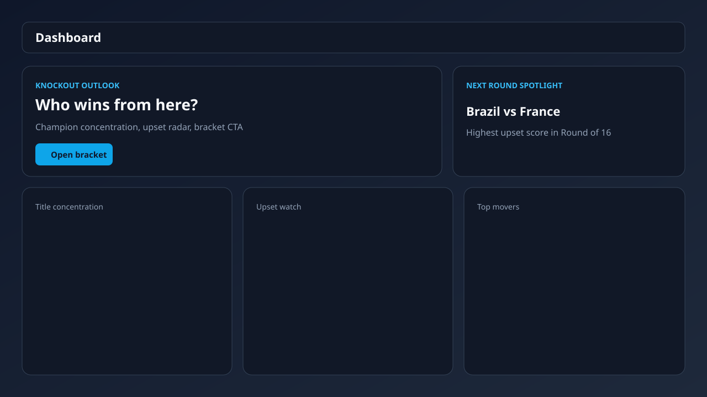
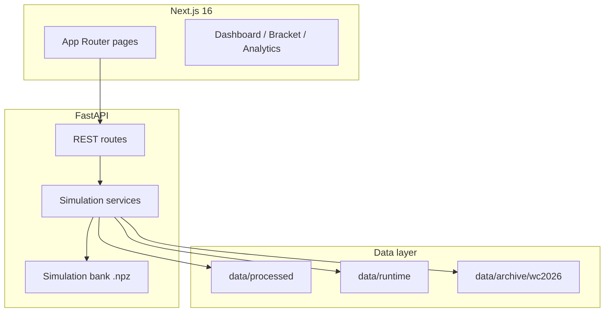

# World Cup Oracle

**Monte Carlo World Cup forecasting — bracket probabilities, what-if scenarios, and post-tournament retrospectives from one simulation engine.**

World Cup Oracle is a full-stack portfolio project: FastAPI simulation backend, Next.js dashboard, precomputed simulation banks, and a frozen archive mode for demos after the final whistle.



## Try this (local)

Start both servers:

```bash
./scripts/dev.sh
```

Then open:

| Page | URL | What to look for |
|------|-----|------------------|
| **Dashboard** | http://localhost:3000/ | Knockout outlook, upset spotlight, bracket CTA |
| **Bracket** | http://localhost:3000/bracket | Bank plurality trace, match drawer with H2H + what-if links |
| **What-if** | http://localhost:3000/what-if?overrides=R16-01:2-1 | Deep-linked scenario override |
| **Teams** | http://localhost:3000/teams | Still-in filter, champion sort, round badges |
| **Compare** | http://localhost:3000/teams/compare?a=ARG&b=FRA | Side-by-side paths and meeting odds |
| **Retrospective** | http://localhost:3000/retrospective | Champion arc, model hits/misses, calibration |
| **Models** | http://localhost:3000/models | Current-tournament + historical holdout scoring |

Curated what-if presets are on the What-if page (`Underdog wins next`, `All favorites advance`, `Chaos round`).


## Architecture



Read the engine walkthrough in [`docs/ENGINE.md`](docs/ENGINE.md).

## Stack

| Layer | Tech |
|-------|------|
| Frontend | Next.js, TypeScript, Tailwind CSS, shadcn/ui, Recharts |
| Backend | FastAPI, Pydantic, NumPy, SciPy, scikit-learn |
| Data | JSON snapshots, SQLite runtime store, compressed simulation banks |
| Tests | **790+** pytest cases (`apps/api/tests/`) |

## Quick start

```bash
./scripts/dev.sh
```

Override simulation counts for local testing:

```bash
NEXT_PUBLIC_WCO_SIMULATIONS=5000 \
NEXT_PUBLIC_WCO_ANALYTICS_SIMULATIONS=1000 \
./scripts/dev.sh
```

Data mode (backend):

```bash
WORLD_CUP_DATA_MODE=processed   # default — checked-in WC 2026 data
WORLD_CUP_DATA_MODE=sample      # 48-team dev sample
```

Published UI pages read `data/processed/forecast_snapshot.json` and related sidecars — they do not rerun full Monte Carlo on every navigation.

## Operator vs showcase

| Concern | Default showcase | Operator mode |
|---------|------------------|---------------|
| Result sync UI | Hidden (`NEXT_PUBLIC_WCO_ADMIN_UI` unset) | Set `NEXT_PUBLIC_WCO_ADMIN_UI=true` |
| Live data refresh | CLI/cron via `POST /admin/sync/results` | Requires `WCO_ADMIN_SYNC_KEY` |
| Post-final demo | `bash scripts/freeze_tournament_archive.sh` then `WCO_ARCHIVE_MODE=wc2026` | Sync returns 409; header shows frozen badge |

## Development

**API**

```bash
cd apps/api
source .venv/bin/activate
bash ../../scripts/clean_pycache.sh
pytest -q
uvicorn app.main:app --reload
```

**Web** (use Bun)

```bash
cd apps/web
bun install
bun run dev
bun run build
```

Regenerate bootstrap forecast after bank-affecting changes:

```bash
bash scripts/regenerate_bootstrap_snapshot.sh
```

## Key features

- 48-team FIFA format with Round of 32 and best-third-place logic
- Precomputed simulation banks for consistent dashboard/bracket/team-path probabilities
- What-if scenario lab with bracket deep links
- Upset radar, group chaos, probability timeline with milestone scrubber
- Head-to-head meeting odds from bank traces (with live fallback)
- Team compare page and tournament retrospective
- Historical backtests (2022, 2018, 2014) on the models page
- Frozen `wc2026` archive mode for portfolio demos

## Limitations

- Forecasts are probabilistic, not betting advice.
- Historical evaluations use fixed past-tournament datasets with era rating proxies.
- Small diagnostic simulation counts are unstable; production snapshots use ≥1,000 paths.
- ML ensemble weights are not retrained on every matchday.
- Screenshot assets in `docs/screenshots/` are stylized placeholders for README layout.

## License / data

Tournament fixtures and results are derived from public football data sources documented in processed metadata. See `data/processed/metadata.json` for provenance notes.
