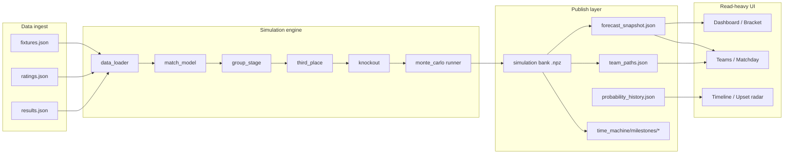

# World Cup Oracle — simulation engine

This document explains how tournament data flows through the World Cup Oracle backend: from checked-in fixtures to Monte Carlo banks, published forecasts, and UI-facing probabilities.

## Pipeline overview



## Layers

### 1. `data_loader`

- Loads `teams`, `groups`, `fixtures`, `ratings`, and `metadata` for `processed` or `sample` mode.
- `get_processed_data_dir()` resolves, in order:
  1. Frozen archive (`WCO_ARCHIVE_MODE=wc2026` → `data/archive/wc2026/`)
  2. Active runtime snapshot (`data/runtime/data/<id>/`)
  3. Bootstrap seed (`data/processed/`)
- Keeps API routes thin: business logic never hardcodes file paths.

### 2. `match_model`

Model order (simple → complex):

1. Elo baseline
2. Calibrated Elo (default production model)
3. Poisson scoreline model
4. Dixon–Coles adjustment
5. Oracle v2 / v3 ensemble (GBM + Elo blend)

Each model exposes win/draw/loss (or advance) probabilities for a fixture given team ratings and stage context.

### 3. `group_stage`

- Simulates unplayed group matches from the match model.
- Respects completed real results already in `fixtures.json`.
- Builds group tables with FIFA tie-breakers (head-to-head, goal difference, goals scored, conduct, FIFA ranking, team ID).

### 4. `third_place`

- Ranks third-place teams across groups.
- Selects the best eight for Round of 32 using FIFA Annex C ordering.

### 5. `knockout`

- Materializes the 48-team bracket (Round of 32 → Final).
- Simulates unplayed knockout ties with extra time and penalties when needed.
- Supports plurality bracket traces derived from bank counts.

### 6. `monte_carlo` runner

- Runs `N` independent tournament simulations with a fixed master seed for reproducibility.
- Aggregates stage counts, champion probabilities, upset scores, and path traces.
- Diagnostic endpoints cap `N` for interactive use; published UI reads precomputed banks.

### 7. Bank + aggregation

**Why a simulation bank?**

- Dashboard, bracket, team paths, head-to-head (post-groups), and third-place views all need consistent probabilities from the *same* simulated futures.
- Re-running Monte Carlo per page would be slow and could disagree across views.
- A bank stores compressed per-simulation traces (`champion`, `knockout_opponents`, etc.) once; aggregation is O(bank size).

**Publish flow**

1. Result sync validates staged fixtures/results.
2. `build_simulation_bank()` writes `bank-<seed>-<n>.npz`.
3. `build_forecast_snapshot_from_bank()` derives summary, bracket, upsets, chaos.
4. `team_paths.json` and `probability_history.json` sidecars update.
5. Runtime SQLite marks the new data + forecast snapshots active.

Bootstrap regeneration (no live sync):

```bash
bash scripts/regenerate_bootstrap_snapshot.sh
```

Post-tournament freeze:

```bash
bash scripts/freeze_tournament_archive.sh
WCO_ARCHIVE_MODE=wc2026 uvicorn app.main:app
```

### Time-machine artifacts

`time_machine_generator` slices the same frozen `TournamentConfig` at nine
checkpoints: pre-kickoff, three group matchdays, and each knockout round through
the final. Group fixtures remain scheduled with future results cleared; knockout
fixtures after the cutoff are removed completely so future pairings cannot leak.

Each available milestone contains:

- `bank.npz` — the coherent Monte Carlo trace bank;
- `snapshot.json` — forecast, observed group tables, sliced fixtures, movers, and provenance;
- `team_paths.json` — lazy team-path responses derived from that bank.

`manifest.json` records availability, data/model versions, seed, simulation count,
fingerprint, byte size, and checksum. Seeds are SHA-256-derived from data version,
model version, and milestone ID. Normal result sync does not regenerate replay;
generation is an explicit offline operation with atomic JSON writes and fingerprint
resume support.

```bash
cd apps/api
WCO_TIME_MACHINE_SIMULATIONS=100000 \
  python -m app.services.time_machine_generator --require-complete
```

The freeze script runs that completeness gate before copying the processed dataset.
API replay reads never invoke Monte Carlo and return 503 for missing, corrupt, or
stale artifacts.

## Determinism

- Given the same `data_version`, `model_type`, `master_seed`, and `n_simulations`, bank generation is deterministic.
- Tests rely on fixed seeds and checked-in processed data.
- What-if scenarios accept explicit overrides and a scenario seed without mutating published banks.

## What the UI reads (no live Monte Carlo by default)

| Surface | Source |
|---------|--------|
| Dashboard hero / signals | `forecast_snapshot.json` |
| Bracket plurality trace | Bank-derived bracket in snapshot |
| Team probabilities | Snapshot summary |
| Team path explorer | `team_paths.json` or bank |
| Head-to-head (knockout era) | Bank `knockout_opponents` arrays |
| Timeline / retrospective | `probability_history.json` |
| Replay-enabled surfaces | `time_machine/milestones/<id>/snapshot.json` |
| Replay team paths / comparisons | Milestone `team_paths.json` / `bank.npz` |
| What-if lab | Live scenario simulation (capped `N`) |

## Limitations (by design)

- Small diagnostic simulation counts are noisy; production snapshots use 1,000–100,000 paths.
- Historical backtests use era strength proxies, not true pre-tournament ratings.
- Archive mode disables live sync so the showcase dataset never drifts after the final.
- GBM / ensemble weights are not re-fit on every matchday in the current stack.

## Related docs

- [`docs/tournament-rules.md`](tournament-rules.md) — FIFA format and tie-breakers
- [`docs/model-notes.md`](model-notes.md) — model assumptions and maturity
- [`README.md`](../README.md) — quick start and showcase tour
